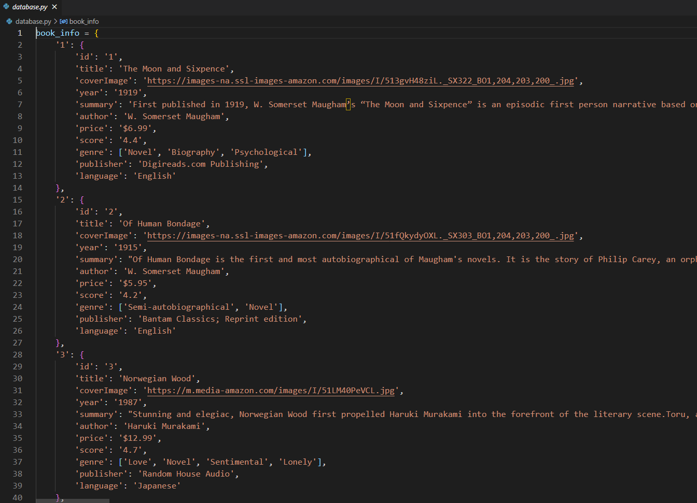

# bookstore_application

YouTube 演示视频链接：

https://youtu.be/i6g075mwQmc

## 1. 开启

在根目录下执行：

`python server.py`

在该链接打开：

http://127.0.0.1:5000/

## 2. 结构

目录

​	/templates: HTML文件

​	/static: js文件

​	/database: 数据库，python字典形式

​	/server: Flask服务器

​	/topK.py: 最大根算法得到评分最高的三项

## 3. 前端

路由：

### 1. /

有三个推荐结果的主页：

.assets/image-20220316195115029.png)

### 2. /view/<id>

id为5的书的详情页

.assets/image-20220316195334913.png)

### 3. /edit/<id>

编辑 ID 为“5”的书的页面。 编辑按钮位于 /view 页面的右上角

.assets/image-20220316195359436.png)

**如何编辑？**

请参阅页面底部的修改提示。

编辑时的样子：

.assets/image-20220316200752909.png)

.assets/image-20220316200907969.png)

**编辑过后：**

用户按下“放弃更改”后，页面应显示一个对话框小部件，询问他们是否确定。 如果他们确定，不要保存数据，而是让用户回到 view/<id> 页面，这样他们就可以看到他们的编辑还没有保存。 如果他们不确定，让他们继续编辑。

**提交编辑后：**

.assets/image-20220316195816426.png)

### 4. /search_result/<input>

.assets/image-20220316195907407.png)

搜索词在网页中突出显示（高亮）

查询对标题和 3 个文本字段进行不区分大小写的子字符串匹配：标题、作者、流派

.assets/image-20220316195955596.png)

### 5. /add

用户可以将书籍项目添加到数据库中

.assets/image-20220316200014275.png)

一些输入框限制了常规语言的输入。

.assets/image-20220316200300941.png)

提交成功后，可以点击“在这里查看”查看结果（已经入库）

.assets/image-20220316200321794.png)

See it here:

.assets/image-20220316200334684.png)

**错误检测：**

定位到第一个错误：

.assets/image-20220316200233523.png)

## 4. 后端

使用 flask 作为后端

如何获得 3 个得分最高的分数推荐？

最大堆算法

## 5. 数据库

