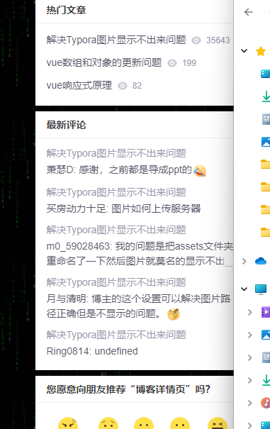

# bookstore_application

## 1. Start tips

In the root directory:

`python server.py`

## 2. Structure

directories: 

​	/templates: HTML files

​	/static: js files

​	/database: Database, python dict

​	/server: Flask server

​	/topK.py: Maximum root function to find the highest rated book

## 3. Frontend

Routes: 

### 1. /

Home page with the three highest rated books:

### 2. /view/<id>

Details page for the book with id "1"

### 3. /edit/<id>

Edit page for the book with id "1". Edit button is on the top right corner in the /view page

**How to edit?**

See modify tips at the bottom of the page.

What it looks like when editing:

**After editing:**

After the user presses “discard changes” the page should present a dialog box widget that asks whether they are sure. If they are sure, don’t save the data, but take the user back to the view/<id> page so they can see their edits have not been saved. If they aren’t sure, let them keep editing.

**After clicking submit:**

### 4. /search_result/<input>

Search words are highlighted in the web page

The query does substring matching that is not case sensitive on the title and 3 text field: Title, Author, Genre

### 5. /add

User can add a book item into the database

Some input boxes limit the input with regular language.

After successfully submitted, you can tap 'See it here' to view the result(It has already been in the database)

See it here:

Error detecting:

Focus on the first error:

## 4. Backend

Using flask as the back-end

How to get the 3 top scored mark recommendations?

Max heap algorithm

